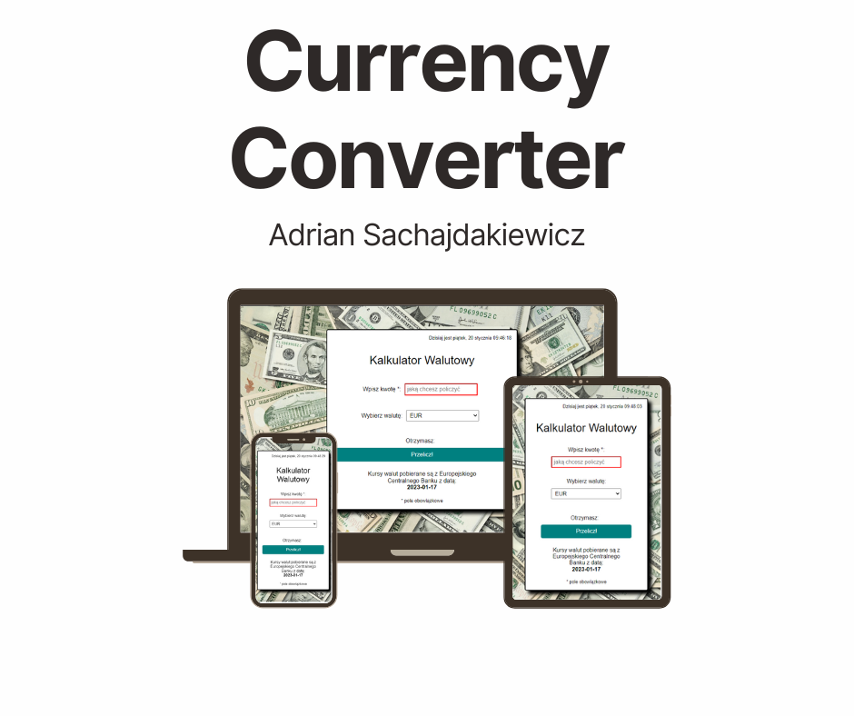
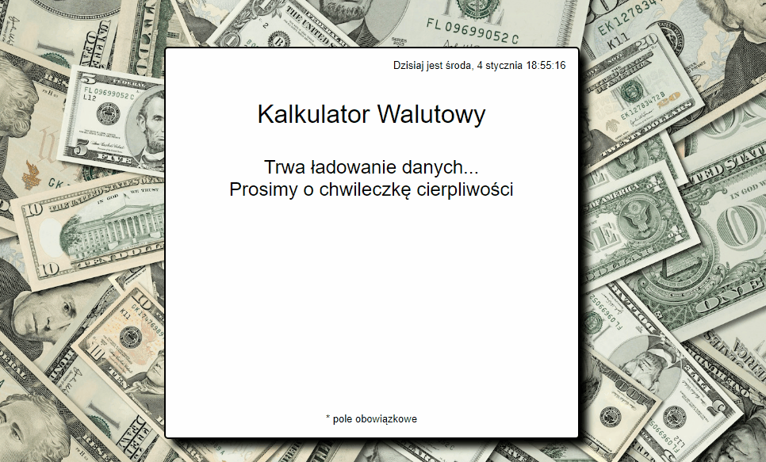

# Currency Converter

This project was bootstrapped with [Create React App](https://github.com/facebook/create-react-app).

## Table of content
1. Demo
1. Preview
1. Description
1. Technologies
1. Getting started

## DEMO
[Currency-converter-react DEMO](https://adriansacha.github.io/currency-converter-react/)

## PREVIEW

## Description
1. Choose your currency
2. Choose currency to exchange
3. Write down amount, you want to exchange in `Wpisz kwotę` input area
4. Press `Przelicz!` button
5. Your result is showing below

Currencies are loaded from European Central Bank
## Technologies used in project

- `HTML`
- `BEM`
- `CSS`
- `Flex/Grid`
- `Transition`
- `Media query`
- `JS/ES6+`
- `Immiutability`
- `Babel`
- `React`
- `Styled Components`
- `GlobalStyles & Theme`
- `useState`
- `useEffect`
- `Custom Hooks`
- `Axios`
- `promises`
- `API`

## Available Scripts
In the project directory, you can run:

### `npm start`
Runs the app in the development mode.\
Open [http://localhost:3000](http://localhost:3000) to view it in your browser.

The page will reload when you make changes.\
You may also see any lint errors in the console.

### `npm run build`
Builds the app for production to the `build` folder.\
It correctly bundles React in production mode and optimizes the build for the best performance.

The build is minified and the filenames include the hashes.\
Your app is ready to be deployed!

See the section about [deployment](https://facebook.github.io/create-react-app/docs/deployment) for more information.